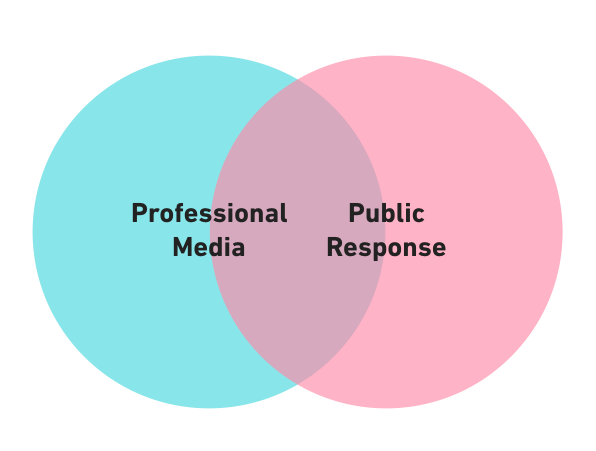
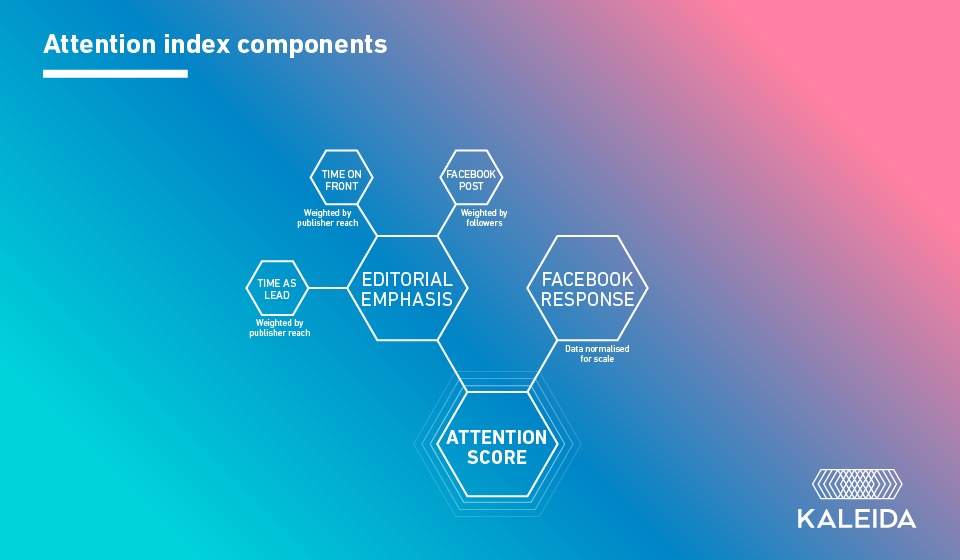

# DOCUMENTATION #

## SUMMARY ##

**Kaleida's Attention Index** is a measure of observed interest in subjects. The index is derived using publicly available data from global news media and social platforms.

Publisher data and social data are combined to arrive at an overall Attention Score. We obtain this data using a range of tools to process the data including our own homegrown applications and 3rd party data processing services as described below. The data is then scored and ranked by an algorithm which is described in detail via a [python jupyter notebook](http://nbviewer.jupyter.org/github/kaleida/attention-index/blob/master/data/attention-index.ipynb). The data is available for [download](../data) and reusable via an open license.

## METHODOLOGY ##

You are encouraged to apply our approach to developing Attention Scores for your own needs. The following methodology provides detail about what the data means, how it was collected and what we're doing with it.

The process begins by collecting published content. For each publisher in our list our crawlers scan publisher home pages, Google sitemaps and Facebook brand pages to identify URLs. We look at URL patterns for each publisher to identify content types, excluding offsite links, links to index pages or other stuff we don't care about.

The scanning process is performed on a regular basis in order to identify 1) when new articles exist, 2) when promotion of an article begins, 3) when promotion of an article ends, 4) changes in placement of an article on publisher properties including whether or not an article is the lead article on the web site home page.

When a new URL is discovered our tools extract data about the page including data from any meta tags.

Then we process the article. First we identify the body text and pass it to a natural language processor to extract the terms mentioned in the text. We differentiate between a thing that is mentioned vs what the article is about by separating out the terms which are in the headline, standfirst and first paragraph from the other mentioned terms. We also run the body text through sentiment analysis tools.

Processing is handled by tools developed inhouse, [Google's NLP services](https://cloud.google.com/natural-language/), and a service called [Aylien](http://aylien.com/).

Next we track performance. We look at engagement on Facebook while simultaneously updating promotion data with each publisher scan. We use Facebook's graph API to collect social activity for each URL. Facebook returns the number of shares, number of comments and number of reactions. We collect this data on a regular basis until the sharing activity appears to stop.

All this data is stored using [Elasticsearch](https://www.elastic.co/) and hosted via [Amazon Web Services](https://aws.amazon.com/).

The stats for each article then get rolled up into buckets, as needed. For example, we can query aggregate totals for shares of all articles by a given publisher for any given time period. Data can be sorted and filtered by total engagements, engagements per minute, publisher, subject, list of subjects, promotion time, promotion placement, etc.

More details about the fields available, descriptions of the data, and sample output are described in the [definitions doc](DEFINITIONS.md).
